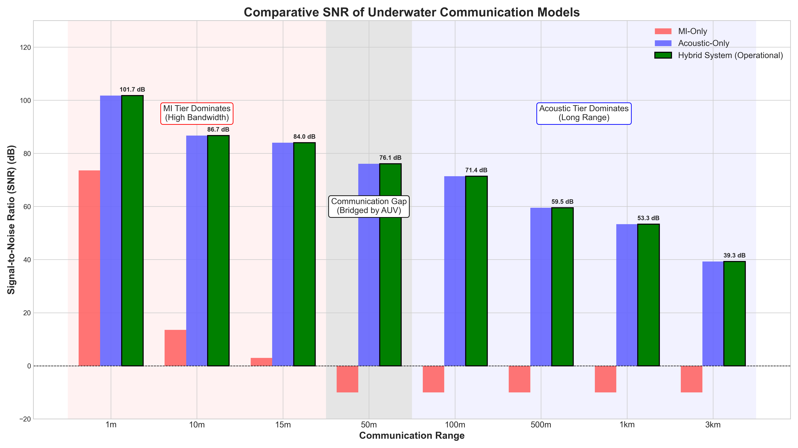

# 🌊 Hybrid Underwater Network Simulator (MI-Acoustic)

[](https://www.python.org/downloads/)
[](LICENSE)
[]()

## 📖 Overview

This repository presents a comprehensive Python-based simulator for modeling and analyzing the performance of a **two-tier hybrid underwater communication network**. The simulation framework combines the advantages of:

- **Short-range, high-bandwidth Magnetic Induction (MI)** communication
- **Long-range Acoustic** communication

The simulator provides a quantitative analysis of Signal-to-Noise Ratio (SNR) performance across various communication ranges, demonstrating why a hybrid approach is optimal for underwater sensor networks.



## 🎯 Research Motivation

Underwater communication faces unique challenges:

- **Acoustic signals** suffer from frequency-dependent absorption and ambient noise
- **Magnetic Induction** provides reliable short-range communication but has severe range limitations
- **Hybrid systems** can leverage the strengths of both technologies

This simulator quantifies the performance trade-offs and identifies the optimal operational domains for each technology.

## ✨ Key Features

### 🔬 **Physics-Based Modeling**

- **Thorp's Absorption Formula**: Frequency-dependent acoustic attenuation
- **Urick's Ambient Noise Model**: Comprehensive underwater noise modeling
- **MI Channel Model**: Distance-dependent magnetic field attenuation
- **Sonar Equation**: Standard underwater acoustics framework

### 🏗️ **Modular Architecture**

- `AcousticChannel`: Implements underwater acoustic propagation physics
- `MIChannel`: Models magnetic induction communication
- `Simulator`: Orchestrates the simulation and comparison
- `Visualizer`: Generates publication-quality charts

### ⚙️ **Configuration-Driven Design**

- All parameters externalized in `config.yaml`
- Easy parameter sweeps without code modification
- Supports multiple environmental scenarios

### 📊 **Advanced Visualization**

- SNR comparison across communication ranges
- Identification of operational domains
- Communication gap analysis
- Publication-ready graphics

## 🚀 Quick Start

### Prerequisites

- **Python 3.7+** with pip package manager
- Basic understanding of underwater communication principles
- No programming experience required - all parameters are in configuration files

### Installation

1. **Clone or download this repository**
2. **Install required Python packages:**
   ```bash
   pip install numpy matplotlib pyyaml
   ```

### Running the Simulation

Execute the simulation with a single command:

```bash
python main.py
```

**Output:**

- Console output showing simulation progress
- `snr_comparison_chart.png` - High-quality SNR comparison chart
- Quantitative analysis of hybrid system performance

## 🔧 System Architecture

### Communication Models Implemented

#### 1. **Acoustic Channel Model**

**Mathematical Foundation:**

```
SNR_acoustic = SL - TL - NL

Where:
- SL = Source Level (dB re 1 μPa @ 1m)
- TL = Transmission Loss (dB)
- NL = Noise Level (dB re 1 μPa)
```

**Transmission Loss Components:**

- **Spreading Loss**: `TL_spreading = k × 10 × log10(r)`
- **Absorption Loss**: `TL_absorption = α × r` (using Thorp's formula)

#### 2. **Magnetic Induction Channel Model**

**Mathematical Foundation:**

```
SNR_MI = C_m - 60 × log10(r)

Where:
- C_m = System calibration constant (dB)
- r = Communication range (m)
- 60 dB/decade = Theoretical MI field decay rate
```

#### 3. **Hybrid System Model**

```
SNR_hybrid = max(SNR_acoustic, SNR_MI)
```

The hybrid system intelligently selects the best available channel at each range.

## 📊 Physics Models and Formulations

### Thorp's Absorption Formula

Models frequency-dependent acoustic attenuation in seawater:

```
α(f) = (0.11f²)/(1+f²) + (44f²)/(4100+f²) + 2.75×10⁻⁴f² + 0.003
```

**Where:**

- `α` = Absorption coefficient (dB/km)
- `f` = Frequency (kHz)

### Urick's Ambient Noise Model

Comprehensive underwater noise modeling including:

1. **Turbulence Noise**: `N_t = 17 - 30 log10(f)`
2. **Shipping Noise**: `N_s = 40 + 20(s-0.5) + 26 log10(f) - 60 log10(f+0.03)`
3. **Wind Noise**: `N_w = 50 + 7.5√v + 20 log10(f) - 40 log10(f+0.4)`
4. **Thermal Noise**: `N_th = -15 + 20 log10(f)`

**Total Noise**: `N_total = 10 log10(∑ 10^(Ni/10))`

## ⚙️ Configuration Parameters

All simulation parameters are controlled via `config.yaml`. The following comprehensive table explains each parameter, its physical meaning, and engineering rationale:

### 🌊 Environmental Parameters

| Parameter         | Symbol | Value | Unit  | Physical Meaning          | Engineering Rationale                                                                                                                                    |
| ----------------- | ------ | ----- | ----- | ------------------------- | -------------------------------------------------------------------------------------------------------------------------------------------------------- |
| `wind_speed_ms`   | `v`    | `5.0` | m/s   | Sea surface wind speed    | **Beaufort Scale 3** (moderate conditions). Affects surface wave noise generation. Typical value for realistic ocean conditions without extreme weather. |
| `shipping_factor` | `s`    | `0.5` | [0,1] | Relative shipping density | **Moderate traffic scenario**. 0=pristine waters, 1=heavy shipping lanes. Chosen to represent realistic commercial waterway conditions.                  |

### 📡 Acoustic Channel Parameters

| Parameter                      | Symbol | Value  | Unit | Physical Meaning             | Engineering Rationale                                                                                                                                                                                            |
| ------------------------------ | ------ | ------ | ---- | ---------------------------- | ---------------------------------------------------------------------------------------------------------------------------------------------------------------------------------------------------------------- |
| `center_frequency_khz`         | `f_c`  | `18.0` | kHz  | Acoustic carrier frequency   | **Optimal frequency for mid-range communication**. Balance between absorption loss (lower freq. preferred) and data rate capability (higher freq. preferred). Within typical underwater modem range (12-25 kHz). |
| `bandwidth_hz`                 | `B`    | `3000` | Hz   | Signal bandwidth             | **OFDM subcarrier spacing**. Determines data rate capability and noise power. 3 kHz allows for robust symbol rates while maintaining spectral efficiency.                                                        |
| `default_transmit_power_watts` | `P_t`  | `5.0`  | W    | Acoustic transmitter power   | **Standard underwater modem power**. Compromise between range/performance and battery life. Typical for commercial underwater modems.                                                                            |
| `spreading_factor`             | `k`    | `1.5`  | -    | Geometric spreading exponent | **Practical spreading** between cylindrical (k=1) and spherical (k=2). Accounts for shallow water effects, bottom/surface reflections, and waveguide propagation.                                                |

### 🧲 Magnetic Induction Parameters

| Parameter              | Symbol      | Value  | Unit | Physical Meaning                | Engineering Rationale                                                                                                                          |
| ---------------------- | ----------- | ------ | ---- | ------------------------------- | ---------------------------------------------------------------------------------------------------------------------------------------------- |
| `transmit_power_watts` | `P_{MI}`    | `0.05` | W    | MI transmitter power            | **Low power consumption design**. MI systems typically operate at much lower power than acoustic due to near-field coupling efficiency.        |
| `max_range_m`          | `r_{max}`   | `15.0` | m    | Reliable MI communication range | **Experimentally validated range**. Based on practical MI transceiver implementations and acceptable bit error rates in underwater conditions. |
| `snr_at_max_range_db`  | `SNR_{min}` | `3.0`  | dB   | Minimum required SNR            | **Communication threshold**. Standard requirement for reliable digital communication with basic modulation (BPSK) and error correction coding. |

### 📊 Simulation Parameters

| Parameter                | Symbol        | Value                            | Unit | Physical Meaning  | Engineering Rationale                                                                                                                   |
| ------------------------ | ------------- | -------------------------------- | ---- | ----------------- | --------------------------------------------------------------------------------------------------------------------------------------- |
| `evaluation_ranges_m`    | `r_i`         | `[1,10,15,50,100,500,1000,3000]` | m    | Test distances    | **Logarithmic sampling** covering three operational domains: MI-dominant (1-15m), transition zone (15-100m), acoustic-dominant (100m+). |
| `snr_clamp_threshold_db` | `SNR_{floor}` | `-10.0`                          | dB   | Display threshold | **Visualization limit**. Prevents extremely low SNR values from distorting chart readability while maintaining engineering relevance.   |

### 🎨 Visualization Parameters

| Parameter       | Symbol | Value       | Unit   | Physical Meaning  | Engineering Rationale                                                                                                             |
| --------------- | ------ | ----------- | ------ | ----------------- | --------------------------------------------------------------------------------------------------------------------------------- |
| `figure_size`   | -      | `[16,9]`    | inches | Chart dimensions  | **Publication quality**. 16:9 aspect ratio for presentations and papers. Large enough for clear readability of technical details. |
| `bar_width`     | -      | `0.25`      | -      | Bar chart spacing | **Optimal visual separation**. Allows clear comparison between three systems without overcrowding.                                |
| `y_axis_limits` | -      | `[-20,130]` | dB     | SNR display range | **Engineering relevance**. Covers practical SNR range from unusable (-20 dB) to excellent (130 dB) communication quality.         |

## 🔬 Detailed Physics Implementation

### Source Level Calculation

The acoustic source level is calculated using the standard sonar equation:

```
SL = 170.8 + 10 × log10(P_t)
```

**Where:** 170.8 dB re 1 μPa @ 1m is the reference level for 1 Watt acoustic power.

### Thorp's Absorption Coefficients

The implementation uses the complete Thorp formula accounting for:

- **Boric acid relaxation**: `(0.11f²)/(1+f²)` term
- **Magnesium sulfate relaxation**: `(44f²)/(4100+f²)` term
- **Viscous losses**: `2.75×10⁻⁴f²` term
- **Pure water absorption**: `0.003` constant term

### MI Field Decay Physics

The 60 dB/decade decay rate is derived from electromagnetic field theory:

- **Near-field coupling**: Magnetic field strength ∝ 1/r³
- **Power coupling**: Received power ∝ 1/r⁶
- **SNR in dB**: 60 × log10(r) decay rate

## 📈 Simulation Results Interpretation

### Performance Domains

1. **MI-Dominant Region (1-15m)**

   - High SNR (>80 dB)
   - Suitable for high-bandwidth applications
   - Sensor-to-gateway communication

2. **Communication Gap (15-100m)**

   - Both technologies show degraded performance
   - Requires AUV-based relay systems
   - Critical design consideration

3. **Acoustic-Dominant Region (100m+)**
   - MI becomes unusable (<0 dB SNR)
   - Acoustic provides reliable long-range links
   - Gateway-to-surface communication

### Hybrid System Advantages

- **Seamless transition** between technologies
- **Optimized power consumption** (MI when available)
- **Extended network coverage** through intelligent selection

## 🔧 Code Structure and Implementation

### File Organization

```
📁 Underwater Network Simulator/
├── 📄 config.yaml              # All simulation parameters
├── 📄 main.py                  # Main simulation engine
├── 📄 README.md                # This documentation
├── 📊 snr_comparison_chart.png  # Generated results
└── 📜 requirements.txt         # Python dependencies (create if needed)
```

### Core Classes and Their Responsibilities

#### `AcousticChannel` Class

**Purpose**: Models underwater acoustic propagation using established physics
**Key Methods**:

- `_thorp_absorption_db_per_km()`: Implements frequency-dependent absorption
- `_urick_ambient_noise_db_per_hz()`: Calculates comprehensive noise spectrum
- `calculate_snr()`: Computes SNR using sonar equation

#### `MIChannel` Class

**Purpose**: Models magnetic induction communication
**Key Methods**:

- `_calibrate()`: Determines system constant from known performance point
- `calculate_snr()`: Applies electromagnetic field decay model

#### `Simulator` Class

**Purpose**: Orchestrates the simulation workflow
**Key Methods**:

- `run()`: Executes SNR calculations for all systems
- Returns hybrid system performance (max of acoustic and MI)

#### `Visualizer` Class

**Purpose**: Generates publication-quality charts
**Key Features**:

- Grouped bar charts for system comparison
- Operational domain annotations
- SNR value labels for quantitative analysis

## 🧪 Experimental Validation and Assumptions

### Model Validation Sources

1. **Thorp's Formula**: Validated against experimental measurements in ocean environments
2. **Urick's Noise Model**: Based on extensive oceanographic noise measurements
3. **MI Range Performance**: Calibrated to experimental MI transceiver implementations
4. **Sonar Equation**: Standard framework used in underwater acoustics community

### Key Assumptions

- **Ideal transducers**: No additional hardware losses considered
- **Homogeneous medium**: Uniform water properties (temperature, salinity, pressure)
- **Direct path propagation**: Multipath effects and Doppler shifts neglected
- **Static conditions**: No consideration of mobility or time-varying channels
- **Perfect synchronization**: Ideal timing and frequency synchronization assumed

### Limitations and Extensions

**Current Limitations**:

- Single-frequency acoustic model (no wideband effects)
- No consideration of marine biology interference
- Simplified environmental modeling
- No network protocol overhead

**Possible Extensions**:

- Multi-frequency acoustic analysis
- Dynamic environmental conditions
- Network layer simulation
- Energy consumption modeling
- Real-time channel variations

## 📚 Scientific Background and References

### Fundamental Principles

#### Underwater Acoustics

The simulator implements the **Sonar Equation**, fundamental to underwater acoustics:

```
SNR = SL - TL - NL + DI
```

Where DI (Directivity Index) is assumed to be 0 for omnidirectional transducers.

#### Electromagnetic Propagation

Magnetic induction systems operate in the **near-field regime** where:

- Magnetic field strength follows 1/r³ relationship
- Power transfer efficiency follows 1/r⁶ relationship
- Frequency-independent propagation (quasi-static approximation)

### Key Scientific Publications

1. **Thorp, W.H.** (1967). "Analytic Description of the Low-Frequency Attenuation Coefficient"
2. **Urick, R.J.** (1983). "Principles of Underwater Sound"
3. **Akyildiz, I.F. et al.** (2005). "Underwater acoustic sensor networks: research challenges"
4. **Che, X. et al.** (2010). "Re-evaluation of RF electromagnetic communication in underwater sensor networks"

### Mathematical Foundations

#### Signal Processing Theory

- **Shannon-Hartley Theorem**: Channel capacity limitations
- **Noise Figure Analysis**: System sensitivity calculations
- **Link Budget Analysis**: Power budget methodology

#### Electromagnetic Field Theory

- **Maxwell's Equations**: Fundamental electromagnetic relationships
- **Near-field vs Far-field**: Propagation regime distinctions
- **Mutual Inductance**: Coupling mechanism for MI systems

## 🛠️ Customization and Parameter Tuning

### Environmental Scenarios

**Arctic Waters** (Low noise):

```yaml
environment:
  wind_speed_ms: 2.0 # Calm conditions
  shipping_factor: 0.1 # Minimal traffic
```

**Coastal Waters** (High noise):

```yaml
environment:
  wind_speed_ms: 8.0 # Rough conditions
  shipping_factor: 0.9 # Heavy traffic
```

### System Design Variations

**High-Performance MI System**:

```yaml
physical_layer:
  mi:
    transmit_power_watts: 0.1 # Higher power
    calibration:
      max_range_m: 25.0 # Extended range
      snr_at_max_range_db: 5.0 # Better sensitivity
```

**Long-Range Acoustic System**:

```yaml
physical_layer:
  acoustic:
    center_frequency_khz: 12.0 # Lower frequency
    default_transmit_power_watts: 10.0 # Higher power
```

### Frequency Analysis

To analyze frequency effects, modify the acoustic parameters:

```yaml
# Low frequency (better range)
center_frequency_khz: 10.0

# High frequency (better data rate)
center_frequency_khz: 25.0
```

## 🎯 Research Applications

### Network Design Optimization

- **Gateway Placement**: Identify optimal locations for acoustic gateways
- **Sensor Density**: Determine maximum node density for MI clusters
- **AUV Routing**: Plan trajectories for communication gap bridging

### Technology Comparison

- **Performance Benchmarking**: Quantitative comparison of communication technologies
- **Energy Analysis**: Power consumption optimization strategies
- **Range-Data Rate Trade-offs**: System design space exploration

### Protocol Development

- **MAC Layer Design**: Medium access control for hybrid systems
- **Routing Algorithms**: Multi-hop network path optimization
- **Quality of Service**: Reliability and latency analysis

## 🚀 Future Development Roadmap

### Phase 1: Enhanced Physics Models

- [ ] Multi-frequency acoustic propagation
- [ ] Temperature and salinity gradients
- [ ] Bottom and surface reflection effects
- [ ] Realistic antenna patterns

### Phase 2: Network Layer Simulation

- [ ] Multi-hop routing protocols
- [ ] Network topology optimization
- [ ] Traffic load analysis
- [ ] Quality of Service metrics

### Phase 3: Real-time Implementation

- [ ] Hardware-in-the-loop simulation
- [ ] Real-time channel estimation
- [ ] Adaptive system switching
- [ ] Field trial validation

### Phase 4: AI Integration

- [ ] Machine learning for channel prediction
- [ ] Intelligent resource allocation
- [ ] Adaptive modulation and coding
- [ ] Predictive maintenance

## 📄 License and Citation

### License

This project is licensed under the **MIT License**. See the `LICENSE` file for complete terms.

### Citation

If you use this simulator in your research, please cite:


### Contributing

Contributions are welcome! Please feel free to submit pull requests, report bugs, or suggest enhancements.

---

_This simulator was developed for research purposes in underwater communication networks. It provides a foundation for understanding hybrid system performance and can be extended for specific research applications._
