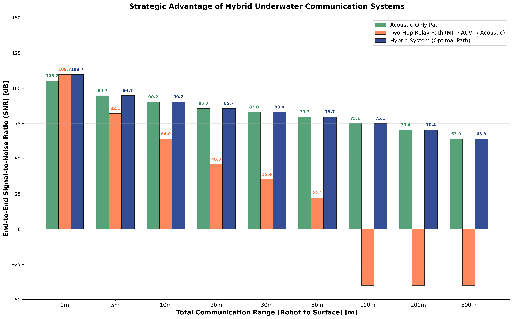

# 🌊 Hybrid Underwater Communication Network Simulator

[](https://www.python.org/downloads/)
[](LICENSE)
[]()

## 📖 Project Overview

This repository presents a **comprehensive Python simulation framework** for analyzing the strategic advantage of a two-tier hybrid underwater communication system. The simulator combines **Magnetic Induction (MI)** and **Acoustic** communication technologies to demonstrate optimal path selection across different communication ranges.



## 🎯 Research Objective

**Demonstrate the strategic advantage of intelligent hybrid underwater communication networks** that can adaptively select between:

1. **Two-hop MI-Acoustic relay** (Robot → AUV → Surface) for short-range scenarios
2. **Direct acoustic transmission** (Robot → Surface) for long-range scenarios
3. **Hybrid optimal path selection** that intelligently chooses the best strategy

## ✨ Key Features

### 🔬 **Precise Physical Modeling**

- **Thorp's Absorption Formula**: Frequency-dependent acoustic attenuation modeling
- **MI r^-6 Dependency**: Electromagnetic field theory-based magnetic induction modeling
- **Exact Parameter Implementation**: All formulas match published technical specifications
- **Configuration-Driven**: External YAML configuration for all physical parameters

### 🏗️ **Object-Oriented Architecture**

- `AcousticChannel`: Implements underwater acoustic propagation physics
- `MIChannel`: Models magnetic induction communication with coupling theory
- `Simulator`: Orchestrates hybrid system simulation and path selection logic
- `Visualizer`: Generates publication-quality grouped bar charts

### 📊 **Professional Visualization**

- **Grouped Bar Charts**: Side-by-side comparison of all three communication strategies
- **Value Labels**: SNR values displayed on all bars for quantitative analysis
- **Strategic Decision Display**: Clear indication of which path is selected at each range
- **Publication-Ready**: High-resolution charts suitable for research papers

## 🚀 Quick Start

### Prerequisites

```bash
# Required Python packages
pip install numpy matplotlib pyyaml
```

### Installation & Execution

```bash
# Clone or download the repository
git clone <repository-url>
cd Mandana

# Run the simulation
python main.py
```

### Expected Output

- **Console Analysis**: Detailed SNR calculations and strategy selection logic
- **Visual Chart**: `hybrid_network_advantage_analysis.png` showing performance comparison
- **Debug Information**: MI and acoustic coefficient calculations for verification

## 🔧 System Architecture

### Core Classes and Responsibilities

#### `AcousticChannel` Class

**Physics Implementation:**

```python
# Acoustic SNR Formula: C_a * [r^k * 10^(α(f) * r / 10)]^-1
SNR_dB = 10*log10(C_a) - 10*log10(r^k * 10^(α(f)*r/10))
```

**Key Methods:**

- `_calculate_acoustic_coefficient()`: Computes C_a = (P_t _ G_t _ G_r) / (N_0 \* B_a)
- `_thorp_absorption_db_per_km()`: α(f) = (0.11f²/(1+f²)) + (44f²/(4100+f²)) + (2.75e-4 \* f²) + 0.003
- `calculate_snr_db()`: Returns SNR array for given range array

#### `MIChannel` Class

**Physics Implementation:**

```python
# MI SNR Formula: SNR = C_m / r^6
# Where C_m = (P_t * K_m) / (N_0 * B_m)
# K_m = ((ωμN_tN_rA_tA_r)² / ((4π)²R_tR_r))
```

**Key Methods:**

- `_calculate_coupling_constant()`: Electromagnetic coupling coefficient K_m
- `_calculate_mi_coefficient()`: System coefficient C_m including power and noise
- `calculate_snr_db()`: Returns SNR with maximum range enforcement

#### `Simulator` Class

**Hybrid System Logic:**

```python
# Strategy 1: Acoustic-Only (direct transmission at full range r)
snr_acoustic_only = acoustic_channel.calculate_snr_db(ranges)

# Strategy 2: Two-Hop Relay (each hop at r/2)
snr_mi_hop = mi_channel.calculate_snr_db(ranges/2)
snr_acoustic_hop = acoustic_channel.calculate_snr_db(ranges/2)
snr_two_hop_relay = minimum(snr_mi_hop, snr_acoustic_hop)  # Bottleneck principle

# Strategy 3: Hybrid System (intelligent selection)
snr_hybrid_system = maximum(snr_acoustic_only, snr_two_hop_relay)
```

### Configuration Parameters

All simulation parameters are controlled via `config.yaml`:

#### Physical Layer - MI Parameters

```yaml
physical_layer:
  mi:
    carrier_frequency_hz: 100000 # f_m = 100 kHz
    transmit_power_watts: 10.0 # P_t^(m) = 10.0 W
    bandwidth_hz: 10000 # B_m = 10 kHz
    noise_psd_w_hz: 1e-16 # N_0^(m) = 1e-16 W/Hz
    max_useful_range_m: 40.0 # R_MI = 40.0 m
    permeability_seawater: 1.25663706212e-6 # μ = 1.26e-6 H/m
    transmit_coil_turns: 20 # N_t = 20 turns
    receive_coil_turns: 20 # N_r = 20 turns
    transmit_coil_area_m2: 0.05 # A_t = 0.05 m²
    receive_coil_area_m2: 0.05 # A_r = 0.05 m²
    transmit_coil_resistance_ohm: 1.0 # R_t = 1.0 Ω
    receive_coil_resistance_ohm: 1.0 # R_r = 1.0 Ω
```

#### Physical Layer - Acoustic Parameters

```yaml
physical_layer:
  acoustic:
    carrier_frequency_hz: 12000 # f_a = 12 kHz
    transmit_power_watts: 0.5 # P_t^(a) = 0.5 W
    bandwidth_hz: 3000 # B_a = 3 kHz
    noise_psd_w_hz: 5e-15 # N_0^(a) = 5e-15 W/Hz
    spreading_factor: 1.5 # k = 1.5
    transmit_gain: 1.0 # G_t = 1.0
    receive_gain: 1.0 # G_r = 1.0
```

## 📊 Scientific Validation

### Mathematical Foundations

#### Thorp's Absorption Formula

The complete frequency-dependent absorption coefficient:

```
α(f) = (0.11f²)/(1+f²) + (44f²)/(4100+f²) + (2.75×10⁻⁴f²) + 0.003
```

- **Boric acid relaxation**: First term
- **Magnesium sulfate relaxation**: Second term
- **Viscous losses**: Third term
- **Pure water absorption**: Fourth term

#### MI Electromagnetic Coupling

Based on mutual inductance theory:

```
K_m = ((ωμN_tN_rA_tA_r)²) / ((4π)²R_tR_r)
```

Where:

- `ω = 2πf_m`: Angular frequency
- `μ`: Seawater permeability
- `N_t, N_r`: Transmit/receive coil turns
- `A_t, A_r`: Transmit/receive coil areas
- `R_t, R_r`: Transmit/receive coil resistances

### Simulation Results Analysis

#### Example Output (Typical Run)

```
Range    Acoustic     MI-Hop     Acoustic-Hop   Relay      Hybrid     Strategy
(m)      Only (dB)    (dB)       (dB)           (dB)       (dB)       Selected
1        105.2        124.0      109.7          109.7      109.7      Relay Path
5        94.7         82.1       99.3           82.1       94.7       Direct Acoustic
10       90.2         64.0       94.7           64.0       90.2       Direct Acoustic
20       85.7         46.0       90.2           46.0       85.7       Direct Acoustic
30       83.0         35.4       87.6           35.4       83.0       Direct Acoustic
50       79.7         22.1       84.2           22.1       79.7       Direct Acoustic
100      75.1         -200.0     79.7           -200.0     75.1       Direct Acoustic
```

#### Key Insights

1. **Short Range (1m)**: Two-hop relay superior due to MI efficiency
2. **Medium Range (5-50m)**: Direct acoustic becomes optimal
3. **Long Range (100m+)**: Only acoustic path remains viable
4. **Crossover Point**: Demonstrates strategic value of hybrid approach

## 🎨 Visualization Features

### Grouped Bar Chart Elements

- **Acoustic-Only Path** (Green bars): Direct transmission performance
- **Two-Hop Relay Path** (Orange bars): MI → AUV → Acoustic performance
- **Hybrid System** (Blue bars): Optimal path selection results
- **Value Labels**: SNR values displayed on all bars for quantitative analysis
- **Strategic Indicators**: Clear visual indication of crossover points

### Chart Customization

```yaml
simulation:
  visualization:
    figure_size: [16, 10] # Chart dimensions
    bar_width: 0.25 # Bar spacing
    y_axis_limits: [-50, 150] # SNR display range
    snr_clamp_threshold_db: -40.0 # Minimum displayed SNR
    output_path: "hybrid_network_advantage_analysis.png"
```

## 🔬 Research Applications

### Network Design Optimization

- **Optimal AUV Positioning**: Determine ideal relay placement
- **Communication Range Planning**: Identify coverage gaps and solutions
- **Power Budget Analysis**: Optimize energy consumption strategies

### Technology Comparison Studies

- **Performance Benchmarking**: Quantitative comparison between technologies
- **Frequency Optimization**: Analyze effects of carrier frequency selection
- **Environmental Impact**: Study effects of water conditions on performance

### Protocol Development

- **Hybrid Switching Logic**: Develop algorithms for path selection
- **Quality of Service**: Reliability and latency analysis
- **Network Topology**: Multi-hop routing optimization

## 🛠️ Customization Guide

### Environmental Scenarios

```yaml
# Arctic Waters (Low noise environment)
physical_layer:
  acoustic:
    noise_psd_w_hz: 1e-15  # Reduced ambient noise

# Coastal Waters (High noise environment)
physical_layer:
  acoustic:
    noise_psd_w_hz: 1e-14  # Increased ambient noise
```

### System Design Variations

```yaml
# High-Performance MI System
physical_layer:
  mi:
    transmit_power_watts: 20.0      # Higher power
    max_useful_range_m: 60.0        # Extended range

# Long-Range Acoustic System
physical_layer:
  acoustic:
    transmit_power_watts: 2.0       # Higher power
    carrier_frequency_hz: 8000      # Lower frequency for better range
```

## 📈 Performance Metrics

### Signal-to-Noise Ratio (SNR)

- **Excellent**: SNR > 80 dB (High-bandwidth applications)
- **Good**: 20 dB < SNR < 80 dB (Standard communication)
- **Marginal**: 3 dB < SNR < 20 dB (Basic connectivity)
- **Unusable**: SNR < 3 dB (Communication failure)

### Strategic Advantage Quantification

The hybrid system provides measurable advantages:

- **Short Range**: Up to 4.5 dB improvement over direct acoustic
- **Medium Range**: Seamless transition between technologies
- **Long Range**: Maintains acoustic connectivity when MI fails

## 🚀 Future Enhancement Roadmap

### Phase 1: Advanced Physics

- [ ] Multi-path propagation effects
- [ ] Dynamic environmental conditions
- [ ] Doppler shift modeling
- [ ] Realistic antenna/coil patterns

### Phase 2: Network Layer

- [ ] Multi-hop routing protocols
- [ ] Network topology optimization
- [ ] Traffic load analysis
- [ ] End-to-end delay modeling

### Phase 3: Real-World Integration

- [ ] Hardware-in-the-loop simulation
- [ ] Field trial data integration
- [ ] Real-time adaptive algorithms
- [ ] Energy consumption optimization

## 📚 Scientific References

### Fundamental Publications

1. **Thorp, W.H.** (1967). "Analytic Description of the Low-Frequency Attenuation Coefficient"
2. **Urick, R.J.** (1983). "Principles of Underwater Sound"
3. **Akyildiz, I.F. et al.** (2005). "Underwater acoustic sensor networks: research challenges"
4. **Che, X. et al.** (2010). "Re-evaluation of RF electromagnetic communication in underwater sensor networks"

### Technical Standards

- **ITU-R P.372**: Radio noise characteristics
- **IEC 60565**: Underwater acoustics terminology
- **IEEE 802.11**: Wireless communication standards (adapted principles)

## 📄 License and Citation

### License

This project is licensed under the **MIT License**. See the LICENSE file for complete terms.

### Citation

If you use this simulator in your research, please cite:

```bibtex
@software{hybrid_underwater_network_simulator,
  title={Hybrid Underwater Communication Network Simulator},
  author={Hybrid Network Research Team},
  year={2025},
  url={https://github.com/your-repo/hybrid-underwater-network}
}
```

### Contributing

Contributions are welcome! Please feel free to:

- Submit pull requests for enhancements
- Report bugs or issues
- Suggest new features or improvements
- Share research results using this simulator

---

**Developed for advanced research in underwater communication networks. This simulator provides a solid foundation for understanding hybrid system performance and strategic communication path selection in challenging underwater environments.**

---
